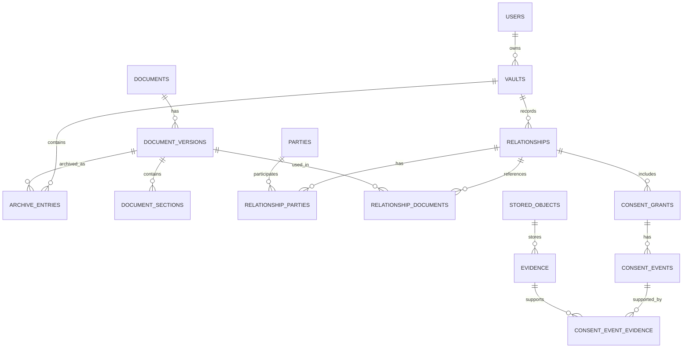

# Open Consent — технічне завдання

**Версія:** 0.2 (проєкт для погодження)  
**Дата:** 20 вересня 2026  
**Статус:** узгоджена концепція та архітектурні принципи; деталі реалізації, позначені «потребує рішення», не затверджені.

## 1. Призначення

Open Consent — відкрита платформа для персонального архівування правових документів, фіксації правовідносин, згод і пов'язаних подій, а також пошуку й аналізу документів за допомогою ШІ з перевірюваними посиланнями на джерела.

Продукт має допомагати людині з'ясовувати, які документи та норми стосуються її ситуації, які права й зобов'язання можуть виникати, які способи припинення відносин або відкликання згоди передбачені та яких відомостей бракує для відповіді. Система не ухвалює юридичних рішень від імені користувача та не прирівнює відповідь ШІ до висновку компетентного органу чи фахівця.

**Базове розмежування:** конституції, закони та інші нормативні акти є правовими джерелами, а не документами, на які користувач персонально «погодився». Прийняття договору, надання конкретної згоди, її відкликання та припинення договору — різні дії з різними можливими наслідками.

## 2. Зафіксовані архітектурні рішення

1. **Універсальна модель архіву:** підтримка нормативних актів, міжнародних документів, договорів, користувацьких угод, дозволів, згод, звернень, відповідей і підтверджень. Універсальність моделі не означає автоматизації всіх юридичних процедур у першому релізі.
2. **Server-first / local-ready:** першою реалізується серверна система, придатна для self-hosted розгортання; згодом — автономний локальний клієнт і вибіркова синхронізація. Логічні ідентифікатори й формат експорту не повинні залежати від сервера.
3. **Гібридне зберігання:** користувач надалі зможе обирати локальне, власне серверне, кероване хмарне або комбіноване розміщення приватних даних. Не заявляти, що всі ці режими вже реалізовані у MVP.
4. **Відокремлення публічного реєстру від приватних архівів:** загальнодоступні нормативні документи можуть використовуватися спільно; приватні документи ізольовані за архівами.
5. **Єдиний Laravel-моноліт:** сервер, вебінтерфейс і бізнес-логіка реалізуються в одному Laravel-проєкті. Інтерфейс — Blade та штатні засоби Laravel; Vue, React, Angular, TypeScript, окремі SPA та інші прикладні фреймворки не використовуються. API додається лише для конкретних інтеграцій та майбутньої синхронізації, а не як обов’язкова основа вебінтерфейсу.
6. **Перевірюваний ШІ-аналіз:** модель отримує лише дозволений контекст; відповіді посилаються на конкретні редакції та положення документів, а невизначеність позначається явно.
7. **Без додаткових фреймворків:** Laravel є єдиним прикладним фреймворком. Допускаються стандартні PHP/JS, штатні компоненти Laravel і драйвери інфраструктури; сторонні UI-фреймворки, реактивні компоненти та окремі frontend-збірки не є вимогою.
8. **Open source і переносимість:** відкриті формати експорту та документовані API; конкретна ліцензія потребує рішення.

## 3. Обсяг робіт

### 3.1. Перший функціональний реліз (MVP)

- Облікові записи, персональні архіви, базова модель ролей та ізоляція даних.
- Завантаження документів, збереження оригіналів, метаданих, редакцій і походження.
- Структурований каталог нормативних документів із юрисдикцією, джерелом, редакціями та датами.
- Реєстрація сторін і правовідносин; прив'язування до них конкретних редакцій документів.
- Реєстрація окремих згод, подій, підтверджень та їхніх зв'язків.
- Пошук і перегляд архіву; експорт документів, метаданих і зв'язків у документованому форматі.
- ШІ-відповіді на запитання за доступними документами з посиланнями на джерела, перевіркою цитат і позначенням браку даних.
- Self-hosted розгортання, резервне копіювання, базові тести безпеки та цілісності.

### 3.2. Після MVP

- Автономний локальний режим і синхронізація: спосіб реалізації має відповідати обмеженню «Laravel як єдиний прикладний фреймворк»; конкретне технічне рішення потребує окремого погодження.
- Керована хмара, додаткові режими шифрування й керування ключами.
- Браузерне розширення та інтеграції зі сторонніми сервісами.
- Підготовка й, лише за окремим підтвердженням користувача, надсилання звернень або повідомлень про відкликання.
- Розширені зв'язки між правовими нормами, автоматичне відстеження змін законодавства та угод.

### 3.3. Поза межами MVP

Автоматичне встановлення юридичної чинності договору, автоматичне визнання порушення права, гарантія припинення обробки даних після натискання кнопки, автономне здійснення юридично значущих дій від імені користувача.

## 4. Ключові користувацькі сценарії

**UC-01. Архівування угоди.** Користувач завантажує угоду, зазначає сторону, дату прийняття (якщо відома) та додає підтвердження. Пізніша редакція угоди не замінює попередню.

**UC-02. Відкликання згоди.** Користувач реєструє згоду на конкретну мету, фіксує факт надсилання відкликання, додає підтвердження отримання та окремо — повідомлення сервісу про виконання. Інтерфейс не змішує ці події.

**UC-03. Питання про припинення відносин.** Користувач питає, як припинити договір і що станеться з його даними. Система зіставляє доступну редакцію договору, застосовні нормативні джерела та відомі обставини; показує посилання й обмеження відповіді.

**UC-04. Історичний аналіз.** Користувач обирає дату; система використовує відповідні редакції документів і не підміняє їх найновішими без пояснення.

**UC-05. Перенесення архіву.** Користувач експортує приватні дані та імпортує їх в інше розгортання без зміни логічних ідентифікаторів документів і втрати зв'язків.

## 5. Доменна модель

### 5.1. Identity & Vault

| Сутність | Призначення | Основні поля |
|---|---|---|
| `users` | Облікові записи | `id`, `name`, `email`, `password_hash` |
| `vaults` | Персональні або спільні архіви | `id`, `owner_id`, `name`, `created_at` |
| `vault_members` | Учасники та ролі | `vault_id`, `user_id`, `role` |
| `archive_entries` | Додавання конкретної редакції до архіву | `id`, `vault_id`, `document_version_id`, `title`, `added_at` |
| `storage_profiles` | Налаштування розміщення об'єктів | `id`, `vault_id`, `driver`, `name`, `configuration` |
| `stored_objects` | Фізичні файли та їхні атрибути | `id`, `vault_id`, `storage_profile_id`, `object_key`, `size_bytes`, `mime_type`, `content_hash_algorithm`, `content_hash` |

`storage_profiles.configuration` не зберігає секрети у відкритому вигляді. Системне сховище публічних джерел відокремлюється від приватних сховищ архівів.

### 5.2. Document Registry

| Сутність | Призначення | Основні поля |
|---|---|---|
| `documents` | Логічний документ | `id`, `owner_vault_id` (nullable для спільного реєстру), `title`, `visibility` |
| `document_versions` | Конкретна редакція | `id`, `document_id`, `version_label`, `original_object_id`, `published_at`, `effective_from`, `effective_to`, `captured_at` |
| `document_sections` | Структурні частини редакції | `id`, `document_version_id`, `parent_id`, `section_key`, `heading`, `text`, `position` |
| `document_sources` | Походження редакції | `id`, `document_version_id`, `source_url`, `publisher`, `retrieved_at`, `verification_status` |

`documents` представляє логічний документ і не містить обов'язкового загального семантичного або юридичного типу. Правове значення фіксується через спеціалізовані доменні сутності та явні зв'язки там, де це доречно. Open Consent не повинен трактувати одну загальну класифікацію документа як встановлений юридичний факт. `visibility` є незалежним від семантичної або юридичної класифікації й описує питання доступу або публікації. `legal_instruments.instrument_type` залишається окремим полем, бо має специфічне доменне значення для нормативних джерел. Згода представлена через `consent_grants`, а не через призначення документу загального типу "consent". `document_versions.version_label` є необов'язковою людиночитною метаданою і не вимагається під час початкового завантаження.

Оригінал документа незмінний після фіксації. Результат витягування тексту з PDF є похідною версіонованою репрезентацією, а не заміною оригіналу. `published_at`, `effective_from`, `captured_at` мають різні значення; застосовність редакції не визначається лише найпізнішою датою.

### 5.3. Legal Sources

| Сутність | Призначення | Основні поля |
|---|---|---|
| `jurisdictions` | Ієрархія юрисдикцій | `id`, `parent_id`, `code`, `name` |
| `legal_instruments` | Нормативний документ | `id`, `document_id`, `jurisdiction_id`, `instrument_type`, `official_number` |
| `legal_provisions` | Положення конкретної редакції | `id`, `instrument_id`, `document_section_id`, `provision_key` |

Нормативні акти **не** реєструються як персонально надані згоди. Зв'язки між нормами, перехідні положення, зміни та скасування потребують окремої моделі на наступному етапі.

### 5.4. Parties & Relationships

| Сутність | Призначення | Основні поля |
|---|---|---|
| `parties` | Записи про осіб та організації | `id`, `vault_id`, `type`, `display_name` |
| `relationships` | Конкретні правовідносини | `id`, `vault_id`, `type`, `status`, `started_at`, `ended_at` |
| `relationship_parties` | Ролі учасників | `relationship_id`, `party_id`, `role` |
| `relationship_documents` | Документи, пов'язані з відносинами | `relationship_id`, `document_version_id`, `role`, `applicable_from`, `applicable_to` |

Запис про сторону або статус правовідносин не є автоматичним підтвердженням юридичної особи, підписання договору чи його чинності. Потрібно зберігати джерело відомостей і відрізняти твердження користувача від незалежно перевірених фактів.

### 5.5. Згоди, події та докази

#### `consent_grants` — предмет конкретної згоди

| Поле | Значення |
|---|---|
| `id` | Ідентифікатор згоди |
| `vault_id` | Архів, у межах якого ведеться запис |
| `relationship_id` | Пов'язані правовідносини, якщо існують |
| `consent_type` | Категорія згоди/дозволу |
| `grantor_party_id` | Хто надав згоду |
| `data_subject_party_id` | Чиїх даних вона стосується; nullable для інших видів згод |
| `recipient_party_id` | Кому надано згоду |
| `document_version_id` | Конкретна редакція умов, якщо згода пов'язана з документом |
| `purpose` | Конкретна мета |
| `scope` | Межі дозволених дій, даних, отримувачів тощо; структурований формат із версіонованою схемою |
| `granted_at` | Заявлений/відомий час надання, nullable, якщо невідомий |
| `expires_at` | Відомий строк завершення, nullable |

`consent_grants` описує **на що** було надано згоду; сам запис не доводить факту її надання. Надання договору й окремої згоди не ототожнюються. У випадках представництва особа, яка надала згоду, може відрізнятися від суб'єкта даних.

#### `consent_events` — хронологія відомих подій

| Поле | Значення |
|---|---|
| `id` | Ідентифікатор події |
| `vault_id` | Архів для ізоляції та контролю доступу |
| `consent_grant_id` | Згода, якої стосується подія |
| `event_type` | Наприклад, `granted`, `withdrawal_requested`, `withdrawal_acknowledged`, `recipient_reported_completion` |
| `actor_party_id` | Сторона, що виконала дію, якщо відома |
| `occurred_at` | Коли подія відбулася за доступними відомостями; може бути невідомо |
| `recorded_at` | Коли Open Consent зареєстрував інформацію |
| `source_type` | Звідки відомо про подію: ручний запис, документ, інтеграція тощо |
| `description` | Додаткові відомості без підміни структурованих полів |

Подія «користувач надіслав відкликання», «отримувач підтвердив отримання» і «отримувач повідомив про виконання» — **різні записи**. Жоден із них сам по собі не означає незалежно перевіреного виконання вимоги. Поточний статус може обчислюватися з подій, але не повинен знищувати їхню історію.

#### `evidence` та `consent_event_evidence` — матеріали та зв'язки

| Поле `evidence` | Значення |
|---|---|
| `id` | Ідентифікатор матеріалу |
| `vault_id` | Архів-власник |
| `type` | Скриншот, лист, квитанція, документ, відповідь API, ручний запис тощо |
| `stored_object_id` | Посилання на файл, якщо він є; без дублювання `storage_ref` |
| `source_party_id` | Від кого отримано матеріал, якщо відомо |
| `description` | Опис матеріалу |
| `captured_at` | Час отримання/фіксації, якщо відомий |
| `recorded_at` | Час додавання запису до системи |

`consent_event_evidence(consent_event_id, evidence_id)` забезпечує зв'язок **багато до багатьох**: одна подія може мати кілька підтверджень, а один матеріал — стосуватися кількох подій. Для всіх зв'язків перевіряється належність до одного архіву. Доказовий матеріал не прирівнюється до автоматично встановленого факту.

### 5.6. Analysis & Audit

- `analysis_runs`: користувач, архів, запитання, час, обраний постачальник/модель, статус, відповідь, застереження; персональні тексти та журнали мають окрему політику зберігання.
- `analysis_sources`: конкретні `document_version_id` і `document_section_id`, використані для відповіді, а також посилання на інші підтверджені матеріали.
- `audit_events`: доступ до приватних даних, експорт, зміни дозволів, адміністративні дії; не записувати повний вміст документів у журнали.

## 6. Зв'язки та інваріанти



Обов'язкові інваріанти:

1. Приватний документ, файл, доказ, згода, подія та їхні зв'язки не можуть перетинати межі архівів без явного дозволеного механізму обміну.
2. `document_sections.parent_id` посилається лише на розділ **тієї самої редакції**; цикли заборонені.
3. Оригінал зафіксованої редакції не перезаписується. Виправлення оформлюються новою редакцією або окремим записом про виправлення.
4. Якщо обидві дати відомі, `effective_to > effective_from`; ці дати самі по собі не доводять застосовність редакції.
5. Для всіх записів згод і доказів перевіряється належність пов'язаних сторін/правовідносин до того самого архіву.
6. Знищення приватного архіву не видаляє спільні нормативні документи.
7. Ідентифікатори сутностей — UUID; імпорт/експорт зберігає їх або явно описує безпечне відображення при конфліктах.
8. Не покладатися лише на перевірки інтерфейсу: застосувати FK, UNIQUE, CHECK, транзакції, авторизацію API; для PostgreSQL оцінити RLS і належно протестувати контекст користувача та фонові завдання.

## 7. SHA-256 та цілісність

- Для кожного оригінального файлу обчислювати SHA-256 **від оригінальних байтів** під час завантаження; зберігати алгоритм і значення в `stored_objects`.
- Під час перенесення, відновлення з резервної копії та за запитом користувача повторно перевіряти відповідність хешу.
- Не дублювати той самий хеш у `document_versions` і `evidence`, якщо вони посилаються на `stored_objects`.
- Витягнутий текст, OCR та інші похідні репрезентації версіонувати окремо; їхня зміна не означає зміни оригіналу.
- SHA-256 виявляє невідповідність файлу збереженому контрольному значенню, але **не доводить** автентичність, підписання, юридичну чинність, час створення чи незмінність у разі одночасної компрометації файлу та БД. Для незалежного засвідчення потрібні окремі механізми.
- Хеш не замінює резервне копіювання або шифрування.

## 8. Зберігання та безпека

- Публічний нормативний реєстр і приватні архіви мають різні політики доступу й зберігання.
- У MVP: self-hosted сервер із налаштовуваним файловим драйвером; локальний автономний режим — наступний етап.
- Доступ до приватних файлів лише через авторизований механізм; не публікувати постійні відкриті URL.
- Секрети зберігати поза відкритою конфігурацією БД; шифрування на сервері **не** називати наскрізним, якщо сервер має ключі.
- Перед передаванням приватних документів зовнішній моделі ШІ потрібен окремий зрозумілий дозвіл. Передавання, збереження запитів постачальником та строки зберігання мають бути прозорими.
- Текст завантаженого документа — недовірені дані, а не інструкції для ШІ; він не може змінювати права доступу або запускати дії.
- Передбачити резервне копіювання, перевірку відновлення, політики видалення й очищення похідних індексів/кешів.

## 9. ШІ-аналіз

Послідовність: запитання → визначення правовідносин, дати та юрисдикції → перевірка доступу → пошук конкретних редакцій і положень → формування обмеженого контексту → відповідь → перевірка посилань на реально отримані джерела → збереження відомостей про використані редакції.

Відповідь повинна:

- відрізняти документально підтверджені відомості від тверджень користувача й припущень;
- цитувати конкретну редакцію та положення, а не лише назву документа;
- вказувати, якщо бракує тексту договору, дати, юрисдикції або інших суттєвих обставин;
- не вигадувати статті, пункти, строки чи підтвердження виконання дій;
- не виконувати юридично значущих дій без окремого підтвердження користувача.

Для MVP достатньо повнотекстового пошуку; семантичний пошук можна додати після перевірки якості на тестових сценаріях.

## 10. Технології та структура

**Узгоджений стек:** один застосунок Laravel (версію PHP та Laravel зафіксувати під час старту репозиторію); серверні шаблони Blade; звичайні HTML/CSS і мінімальний нативний JavaScript там, де він потрібен. Не використовувати Vue, React, Angular, TypeScript, Inertia, Livewire, Alpine або інші додаткові прикладні/UI-фреймворки. Не створювати окремий frontend-застосунок. Вебсторінки формуються контролерами Laravel і Blade; форми використовують стандартні маршрути, Request-валидацію, сесії, CSRF-захист та Policies. API — необов'язковий окремий інтерфейс для майбутніх інтеграцій, не вимога до роботи вебкабінету.

**Інфраструктура:** PostgreSQL як запропонована БД; штатні Laravel Filesystem, Queue, Cache, Mail, Auth та Scheduler. На старті достатньо локального приватного диска і черги `database`; Redis, S3, Docker та окремий пошуковий рушій **не обов'язкові**. Для self-hosted розгортання достатньо PHP, підтримуваної БД і вебсервера. ШІ-адаптер реалізується на PHP усередині Laravel; підключення зовнішнього API не означає додавання фреймворку до проєкту.

```text
open-consent/
├── app/
│   ├── Http/Controllers/
│   ├── Http/Requests/
│   ├── Models/
│   ├── Policies/
│   ├── Jobs/
│   └── Modules/
│       ├── Vault/
│       ├── Documents/
│       ├── LegalSources/
│       ├── Relationships/
│       ├── Consents/
│       ├── Evidence/
│       └── Analysis/
├── resources/
│   ├── views/                 # Blade-шаблони
│   ├── css/                   # CSS без UI-фреймворків
│   └── js/                    # Нативний JS за потреби
├── routes/web.php
├── database/migrations/
├── tests/
└── docs/
```

Модулі — звичайні PHP-класи в межах Laravel, а не окремі застосунки чи пакети з власними фреймворками. Доступ до документів здійснюється через авторизовані сервіси/репозиторії. Публічний нормативний реєстр та приватні архіви використовують різні правила доступу.

**Майбутній локальний режим:** повністю автономний браузерний клієнт неможливо отримати лише серверними Blade-шаблонами. Це окрема архітектурна задача; не додавати інший фреймворк без нового рішення користувача. Варіанти для подальшого розгляду: локально запущений Laravel або інший спосіб автономного доступу в межах узгодженого стеку.

## 11. План реалізації

### Етап 1 — модель даних і безпечний каркас

1. Затвердити словник сутностей, статусів, типів подій і джерел відомостей.
2. Створити ER-діаграму, міграції PostgreSQL, FK/UNIQUE/CHECK та правила ізоляції архівів.
3. Реалізувати `vaults`, `stored_objects`, `documents`, `document_versions`, `document_sections`, `archive_entries`.
4. Реалізувати `parties`, `relationships`, `consent_grants`, `consent_events`, `evidence` і зв'язувальну таблицю.
5. Додати моделі Laravel, сервіси, політики доступу, фабрики та автоматизовані тести.
6. Описати версіонований формат експорту/імпорту та правила сумісності.

**Результат:** міграції застосовуються до чистої БД, усі інваріанти перевіряються тестами, приватні дані не доступні між архівами.

### Етап 2 — реєстр документів і UI

Завантаження/перегляд/версіонування документів, збереження походження, повнотекстовий пошук, експорт, мінімальний кабінет на Laravel Blade і каталог нормативних джерел.

### Етап 3 — правовідносини, згоди й докази

Форми для сторін і правовідносин, окремих згод, подій та підтверджень; відображення хронології без автоматичного приписування юридичного результату.

### Етап 4 — ШІ-аналіз

Пошук контексту, контроль доступу, адаптер моделей, відповіді з перевіреними посиланнями, історія аналізу, тести на вигадані цитати та витік даних.

### Етап 5 — гібридність

Автономний локальний режим у межах погодженого Laravel-стеку (реалізацію визначити окремо), синхронізація, перенесення між інсталяціями, опційна керована хмара та інтеграції.

## 12. Критерії приймання MVP

- [ ] Користувач може створити архів і додати приватний документ.
- [ ] Нова редакція не змінює попередню; історичне посилання вказує на конкретну редакцію.
- [ ] Користувач іншого архіву не може прочитати приватні файли, метадані, докази чи результати аналізу без дозволу.
- [ ] Спільний нормативний документ доступний кільком архівам без копіювання приватних даних.
- [ ] Згода, запит на відкликання, підтвердження отримання та повідомлення про виконання відображаються як окремі події.
- [ ] Одна подія може мати кілька доказів; доказ може бути пов'язаний із кількома подіями в межах дозволеного архіву.
- [ ] Перенесений або відновлений файл проходить перевірку SHA-256; навмисно змінений файл її не проходить.
- [ ] Експорт та імпорт зберігають документи, редакції, зв'язки й походження без порушення ізоляції.
- [ ] ШІ не посилається на неіснуючі положення та вказує, яких джерел або обставин бракує.
- [ ] Передавання приватних документів зовнішньому ШІ не відбувається без дозволу.
- [ ] Self-hosted інсталяція відтворюється за документацією; резервну копію можна відновити.

## 13. Питання, які ще потребують рішення

1. **Ліцензія open source** та правила використання назви/бренду.
2. **Початковий набір нормативних джерел:** які саме юрисдикції, документи, мови, офіційні джерела та умови повторного використання включити в MVP.
3. **Модель архівів:** лише персональні чи відразу спільні/сімейні/організаційні; повноваження представників.
4. **Статуси згод і правовідносин:** які є описовими записами користувача, а які потребують зовнішнього підтвердження.
5. **Політика видалення, строки зберігання, аудит і резервні копії** для різних режимів розгортання.
6. **Режим ШІ за замовчуванням:** локальна модель, зовнішній API або вибір під час налаштування; політика передавання даних.
7. **Механізм синхронізації та конфліктів** для майбутнього локального режиму.
8. **Підтвердження походження та автентичності:** чи потрібні в MVP цифрові підписи, засвідчення часу або лише фіксація доступних матеріалів.

---

*Це ТЗ описує погоджений напрямок продукту й запропоновану технічну реалізацію. Воно не є висновком про юридичну чинність конкретних договорів, згод чи документів.*
